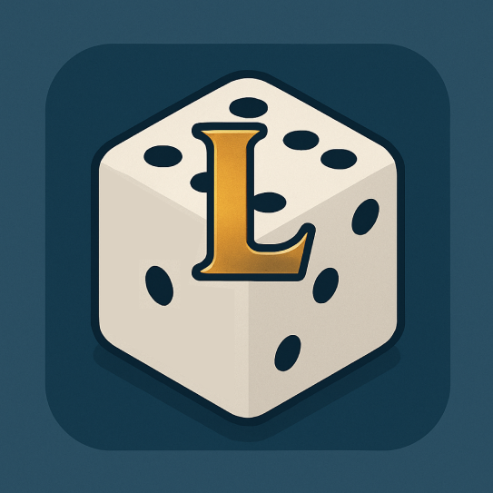

#  League Roller

> A modern League of Legends randomizer to spice up your games!

---

## 🌀 Overview

League Roller is a sleek, modern web app that helps you and your friends randomize your League of Legends experience. Instantly generate random champions, items, runes, summoner spells, and lanes for any game mode like Ranked, ARAM, or Arena. Perfect for custom games, challenges, or just adding a twist to your matches!

---

## ✨ Features

- 🎮 **Game Modes:** Ranked (Summoner's Rift), ARAM, Arena
- 🔀 **Randomize:**
  - Champions
  - Items (with customizable count)
  - Summoner Spells
  - Runes
  - Lanes
- 👥 **Team Support:** Set number of players (up to 5)
- ♻️ **Rerolls:** Allow rerolls per player
- 🌙 **Modern UI:** Beautiful, responsive, and dark-mode by default
- ⚡ **Fast & Smooth:** Built with Vue 3, Vite, and Tailwind CSS

---

## 🖼️ Screenshots

<!-- Replace with actual screenshots if available -->
<p align="center">
  
  <br>
  <i>Modern, clean interface for randomizing your League experience</i>
</p>

---

## 🛠️ Tech Stack

- [Vue 3](https://vuejs.org/)
- [Vite](https://vitejs.dev/)
- [TypeScript](https://www.typescriptlang.org/)
- [Tailwind CSS](https://tailwindcss.com/)
- [shadcn-vue UI](https://ui.shadcn.com/)

---

## 🚀 Getting Started

### Prerequisites

- [Node.js](https://nodejs.org/) (v18+ recommended)
- [npm](https://www.npmjs.com/)

### Installation

```bash
npm install
```

### Development

```bash
npm run dev
```

### Production Build

```bash
npm run build
```

### Lint & Format

```bash
npm run lint
npm run format
```

---

## 📦 Project Structure

```
league-roller/
├── src/
│   ├── components/         # UI components
│   ├── composables/        # Vue composables (logic)
│   ├── lib/                # Utility functions
│   ├── types/              # TypeScript types
│   └── main.ts             # App entry point
├── public/                 # Static assets
├── index.html              # HTML template
└── ...
```

---

## 🤝 Contributing

Contributions, issues, and feature requests are welcome!

1. Fork the repo
2. Create your feature branch (`git checkout -b feature/YourFeature`)
3. Commit your changes (`git commit -m 'Add some feature'`)
4. Push to the branch (`git push origin feature/YourFeature`)
5. Open a pull request

---

## 📄 License

[MIT](LICENSE)

---

<p align="center">
  <b>League Roller</b> &mdash; Randomize. Play. Enjoy!
</p>
